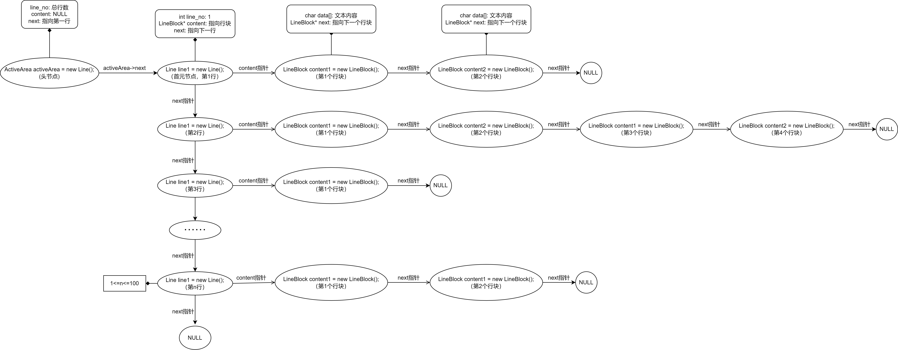

## 简单行编辑器

### 一、要解决的问题

文本编辑程序是利用计算机进行文字加工的基本软件工具，实现对文本文件的插入、删除等修改操作。限制这些操作以行为单位进行的编辑程序称为行编辑程序。被编辑的文本文件可能很大，全部读入编辑程序的数据空间（内存）的做>法既不经济，也不总能实现。一种解决方法是逐段地编辑。任何时刻只把待编辑文件的一段放在内存，称为活区。试按照这种方法实现一个简单的行编辑程序。设文件每行不超过320个字符，很少超过80字符。

****

### 二、算法基本思想描述

- 字符串匹配算法：BF、KMP、Tire、字符串哈希以及AC自动机。
    - BF算法：暴力枚举母串起点和模式串的每一个字符，进行逐个匹配。时间复杂度：$O(NM)$
    - KMP算法：该算法的核心是利用匹配失败后的信息，尽量减少模式串与主串的匹配次数以达到快速匹配的目的。具体实现就是通过一个next[]函数实现，函数本身包含了模式串的局部匹配信息。时间复杂度：$O(N+M)$
    - 字符串哈希：我们定义一个把字符串映射到整数的函数$f$，这个$f$称为是 Hash 函数。我们希望这个函数 $f$可以方便地帮我们判断两个字符串是否相等。Hash 的核心思想在于，将输入映射到一个值域较小、可以方便比较的范围。时间复杂度：$O(N)$
    - Trie算法：Trie树(字典树)是一个可以**高效地存储和查找**字符串集合的一种多叉树的数据结构。每个节点都拥有若干个字符指针，若在插入或检索字符串时扫描到一个字符c，就沿着当前节点的c字符指针，走向该指针指向的节点>。时间复杂度：$O(M)$，空间复杂度：$O(NM)$。（其中N为节点个数，M为字符集大小）

****

### 三、设计

#### 1. 功能描述
程序开始运行时需要键入输入和输出文件。其中输入文件可以为空，表示不从外部文件读取文本。之后会在屏幕上显示当前活区所展示的文本内容（最多100行），第一次使用该编辑器的用户可以键入`help`获取帮助菜单。

##### help menu
- 行插入。格式：i<行号><回车><文本><回车>   将<文本>插入活区中第<行号>行之后。
  
    > Insert Line: Format - `i<line_number><Enter><text>`
    >
    > **Inserts <text> after line <line_number> in the Active Area.**
- 行删除。格式：d<行号1>[ <行号2>]<回车>    删除活区中第<行号1>行（到第<行号2>行）。
  
    > Delete Line: Format - `d<line_number1>[ <line_number2>]`
    >
    > **Deletes line <line_number1> (to line <line_number2>) in the Active Area.**
- 活区切换。格式：n<回车>   将活区写入输出文件，并从输入文件中读入下一段，作为新的活区。
  
    > Switch Active Area: Format - `n`
    >
    > **Write the Active Area to the output file, and read the next segment from the input file as the new Active Area.**
- 活区显示。格式：p<回车>   逐页地（每页20行）显示活区内容。
  
    > Display Active Area: Format - `p`
    >
    > **Display the Active Area content page by page (20 lines per page).**
- 串替换。格式：S<行号>@<串1>@<串2><回车>   将第<行号>行中的<串1>替换成<串2>。
  
    > Replace String: Format - `S<line_number1>[,<line_number2>]@<string1>@<string2>`
    >
    > **Replace <string1> with <string2> in line <line_number1>( to line <line_number2>) of the Active Area.**
- 串匹配。格式：m <串><回车>   匹配活区内所有<串>，并打印匹配成功的位置。
  
    > Match String: Format - `m <string>[ <line_number1>[ <line_number2>]]`
    >
    > **Matched <string>( in line <line_number1>( to line <line_number2>)) in the Active Area and print the position where the match is successful.**
- 读取外部文件。格式：r <文件名><回车>    若当前非活区为空，则可以从外部文件中读入新文本作为待操作内容。
  
    > Read From File: Format - `r <file_name>`
    >
    > **If Other Area is empty, new text can be read from <filename> to Active Area as the content to be operated.**
- 写入外部文件。格式：w <文件名>[ <行号1>[ <行号2>]]    将活区中（第<行号1>行（到第<行号2>行））的内容写入外部文件中。
  
    > Write To File: Format - `w <file_name>[ <line_number1>[ <line_number2>]]`
    >
    > **Write the contents of the Active Area (line <line number 1> (to line <line number 2>)) into <filename>.**
- 退出编辑器。格式：exit<回车> 
  
    > Exit the editor: Format - `exit`

****

### 2. 活区与非活区

- 活区指的是用户当前可修改的文本区，活区最多可以存100行文本，每行文本的最大长度为320个字符。用户可以从输入文件中读取文本到活区中，若输入文件文本内容多于80行，则只读取前80行文本，留下20行给用户操作的空间，而输入文件中的其余文本会暂时存入非活区中。

- 用户可对文本进行自定义操作，操作结束后按下`n`写到输出文件中。此时若非活区中还存有文本，则将非活区中的文本继续按照上述方式继续读入活区中。

- 考虑到文本文件行长通常为正态分布，且峰值在60 ~ 70之间，用320×100大小的字符数组实现存储将造成大量浪费。因此本编辑器采用以标准行块为单位为各行分配存储，每个标准行块含80个字符，并且用动态链表将每一个行块连接起来，从而不会导致内存的浪费。

****

### 3. 活区的表示

每一行采用行块链表存储，每一块最多存储80个字符，若超出限制，则新增一个行块，并且将其于前面的行块连接起来，构成动态链表的形式。如下图所示：

****

#### 3. 活区中每一行的表示

- 每一行采用行块链表存储，每一块最多存储$80$个字符，若超出限制，则新增一个行块，并且将其于前面的行块连接起来，构成动态链表的形式。如下图所示：



****

### 4. 字符串匹配算法的设计

- 在字符串匹配方面：用户可以自行选择采用哪种匹配算法对字符串进行匹配，目前仅提供4种算法：KMP、Trie、字符串哈希、BF。默认采用KMP算法进行字符串匹配。
  
  **1.   KMP**
  
  该算法的核心为next数组，next数组的含义：next[i]表示以i为结尾的后缀最多有多少个字符与前缀相等。在匹配过程中，若未匹配成功，则跳到next所指向的地方继续匹配，而不是每次都跳到起点重新匹配。更详细的算法思路可以参考我之前写过的一篇博客：
  
  https://blog.csdn.net/m0_75186429/article/details/134505128?spm=1001.2014.3001.5501
  
  **2.   Trie**
  
  Trie树又称字典树或前缀树，是一种用于实现字符串快速检索的多叉树结构。匹配效率和KMP算法不相上下。
  
  **3.   字符串哈希**
  
  字符串哈希思路：1. 先预处理所有前缀的哈希，把字符串看成是一个p进制的数，每一位上的字符表示它p进制的数（当p取131或13331，Q取$2^{64}$时，`99.99%`情况下可以假定不会发生冲突）。由于最后要对Q取模，因此可以直接用`unsigned long long`来存储哈希值，溢出的时候会自动对2^64取模。
  
  ```c++
  s = "ABCD"
  -> 'A' 'B' 'C' 'D'
     (1   2   3   4)p // p进制为：1234
   = 1 * p^3 + 2 * p^2 + 3 * p^1 + 4 * p^0 // 十进制
  // 这样就可以把一个字符串转换成一个数字
  // 这个数字可能会非常大，因此要在最后模上一个非常小的数Q
  // 这样就可以把很大的数映射到0 ~ Q - 1
  ```
  
  **4.   BF算法**
  
  BF(Brute Force)算法。顾名思义，是一种最朴素也是最易理解的字符串匹配算法。在匹配过程中，若未匹配成功，则直接跳到起点进行下一次匹配，时间复杂度较高，效率不如KMP算法。
  
  ```c++
  int n = strlen(str), m = strlen(match_str);
  if (m > n) return false;
  // 暴力枚举每次匹配的起点
  for (int i = 0; i <= n - m; i ++ )
  {
      int j;
      for (j = 0; j < m; j ++ )  // 枚举匹配长度
          if (str[i + j] != match_str[j])
              break;
      // 若匹配成功，保存位置
      if (j == m) pos[cnt ++ ] = i;
  }
  ```

****
